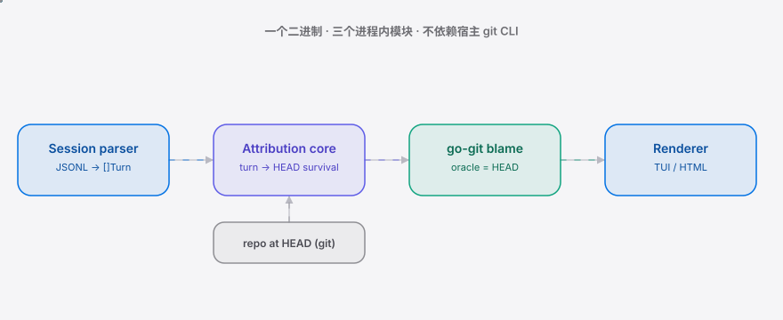

<div align="right"><sub><b>English</b>&nbsp;&nbsp;⇄&nbsp;&nbsp;<a href="./README.md">简体中文</a></sub></div>

<picture>
  <source media="(prefers-color-scheme: dark)" srcset="./assets/hero-dark.svg">
  <source media="(prefers-color-scheme: light)" srcset="./assets/hero-light.svg">
  
</picture>

<p align="center"><sub>Replay every agent session as a red/green "survived vs churned" heatmap. Data never leaves your host.</sub></p>

<p align="center">
  <a href="./LICENSE"></a>
  <a href="https://github.com/SuperMarioYL/survmap/releases"></a>
  <a href="https://github.com/SuperMarioYL/survmap/actions/workflows/ci.yml"></a>
  <a href="https://goreportcard.com/report/github.com/SuperMarioYL/survmap"></a>
  
  <a href="https://gitee.com/SuperMarioYL/survmap"></a>
</p>

> **survmap replays each session as a survival map: which turns' edits lived to the current git HEAD, and which were rolled back / rewritten into "white change".**

You finish a long Claude Code / Codex session — dozens or hundreds of turns — and only the final diff is visible. You cannot tell which turns actually produced durable value and which were churned into stability through repeated rewrites. Survmap scores each turn by whether its edits survived to git HEAD after the session; the oracle is `git blame` / `git log` (machine-checkable, not a post-hoc rationalization), and the replay becomes a red/green survival heatmap: green turns lived, red turns were churn. It runs fully on-host; the session log and repo contents never leave your machine.

<h2> Architecture</h2>

<picture>
  <source media="(prefers-color-scheme: dark)" srcset="./assets/atlas-dark.svg">
  <source media="(prefers-color-scheme: light)" srcset="./assets/atlas-light.svg">
  
</picture>

One binary, three in-process modules, no microservices, no Kubernetes:

- **Session parser** (`internal/session`) — ingests a Claude Code / Codex session JSONL transcript and extracts per-turn file edits and added lines.
- **Attribution core** (`internal/attribution`) — the owned primitive: blames each turn's added lines at HEAD via go-git, attributes survived/churned to the turn, and scores it.
- **Renderer** (`internal/render`) — terminal red/green heatmap + export.

The new primitive is **turn→HEAD-survival attribution**. Given a finished session (a sequence of turns, each a set of file edits) and the repo's current HEAD, the algorithm maps each turn's added lines onto git blame output and scores the turn `survived` / `churned` / `partial`. What is owned is the turn→HEAD mapping layer; the underlying substrate (git) is stable and open — this is not parasitic.

```go
type Turn struct {
    ID    string
    Ts    time.Time
    Edits []FileEdit   // {Path, Tool, AddedLines, LinesAdded, LinesRemoved}
}

type SurvivalScore struct {
    TurnID         string
    Status         Status   // Survived | Churned | Partial | Skipped
    SurvivedLines  int
    ChurnedLines   int
    Evidence       []BlameEvidence  // {Path, LineNo, CommitSHA, Survived}
}

type SessionSurvivalMap struct {
    Turns           []SurvivalScore
    ProductiveTurns int
    WastedTurns     int
    SurvivalRatio   float64
}
```

<h2> Why now</h2>

- Agent coding sessions are now normal and growing long: a single session routinely runs dozens to hundreds of turns, so "the final diff tells the whole story" stops working.
- The "Why does Opus 5 feel worse to work with?" churn anxiety is fermenting — developers increasingly relive "change it, undo it, redo it", so "which turns actually mattered" turns from a curiosity into a must-know.
- The oracle already exists and is stable: git-HEAD survival is a machine-checkable signal. Survival attribution is, for the first time, implementable and quantifiable.

> Honest caveat: survival ≠ absolute effectiveness. A line may "survive" simply because nobody touched it. Survival is a high-suggestiveness indicator, not a verdict on "value"; refactor / force-push / squash merge can flatten per-turn signal, and m2 will add churn-depth as a secondary signal.

## Contents

- [Architecture](#architecture)
- [Why now](#why-now)
- [Install](#install)
- [Quickstart](#quickstart)
- [Usage](#usage)
- [Demo](#demo)
- [Roadmap](#roadmap)
- [Pricing](#pricing)
- [FAQ](#faq)
- [License](#license)

<h2> Install</h2>

Requires Go 1.24 (or grab a release binary and skip Go entirely).

```bash
go install github.com/SuperMarioYL/survmap@latest
```

Or build from source:

```bash
git clone https://github.com/SuperMarioYL/survmap.git
cd survmap && go build -o survmap .
```

> Locked-down / air-gapped hosts: go-git is pure Go, so the single binary needs **no host git CLI** — it runs on machines where git is not installed.

<h2> Quickstart</h2>

Three steps from cold clone to your first survival map (using the bundled sample session):

```bash
go build -o survmap .                                           # 1. build
cd examples/repo && git init -q && git add . && git commit -qm init && cd ../..  # 2. prepare the sample repo at HEAD
survmap score examples/sample.jsonl --repo examples/repo        # 3. per-turn survived/churned table
```

<details><summary>Sample output</summary>

```
Survmap — survival attribution for examples/sample.jsonl against HEAD 35aeb55

TURN   FILE            TOOL     ADD  SURV  CHRN  STATUS
─────────────────────────────────────────────────────────────────────
1      main.go         Write      8     6     2  partial
2      main.go         Edit       2     0     2  churned
─────────────────────────────────────────────────────────────────────
Session: 2 turns · 6/10 lines survived (60.0%) · 1 wasted turns (50.0% of scored)
=> 40% of added lines were churn (1 of 2 turns all-churned).
```

</details>

<h2> Usage</h2>

Your real sessions usually live at `~/.claude/projects/<project>/<session>.jsonl`.

```bash
# per-turn survived/churned scoring (the core command)
survmap score ~/.claude/projects/myproj/abc.jsonl --repo ./myrepo

# red/green survival heatmap (colored terminal)
survmap heatmap ~/.claude/projects/myproj/abc.jsonl --repo ./myrepo

# optional: minimal interactive viewer (bubbletea, q/esc to quit)
survmap heatmap ~/.claude/projects/myproj/abc.jsonl --repo ./myrepo --interactive
```

| Subcommand | What it does | m1 status |
|---|---|---|
| `survmap score <session> --repo <path>` | per-turn survived/churned table | ✅ shipped |
| `survmap heatmap <session> --repo <path>` | terminal red/green heatmap | ✅ shipped |
| `survmap heatmap ... --interactive` | bubbletea interactive viewer | 🟡 m1 minimal, m2 full |
| `survmap heatmap ... --html out.html` | shareable HTML heatmap | ⏳ m2 |

Common flag: `-r, --repo` (git repo worktree root, defaults to `.`). `score` only reads the repo and session log — it never writes or uploads.

<h2> Demo</h2>

`score` then `heatmap` on the sample session: green = survived, red = churned, with the punchline at the bottom.


Full terminal recording (asciinema cast): `assets/demo.cast` (replay locally with `asciinema play assets/demo.cast`).

<h2> Roadmap</h2>

- [x] **m1 — ingest + blame + attribution core**: parse the Claude Code session JSONL, extract per-turn file edits, blame at HEAD via go-git, attribute each turn's added lines as survived/churned, and print a per-turn table via `survmap score`.
- [ ] **m2 — heatmap TUI + HTML**: render the survival map as a red/green heatmap (full interactive bubbletea TUI) + `--html` export; the "last session was X% churn" star moment; a 10-minute installable demo on a real session.
- [ ] **m3 — team ROI dashboard**: aggregate survival ratios by session/developer/repo + optional on-prem domestic LLM (Qwen/DeepSeek) natural-language summary + SRE GPU-spend reconciliation hook. Paid surface, post-v0.1.

Future: cross-platform agent support (Codex et al.), multi-repo / monorepo attribution, live in-session scoring.

<h2> Pricing</h2>

**v0.1 is OSS and free forever on your own machine.** Survmap Team is the on-prem monetization surface for teams — not a cloud SaaS that leaks data:

- **Managed on-prem deployment**: Helm chart / offline install bundle, data stays inside your network (a hard constraint for air-gapped / regulated customers).
- **Team session-ROI dashboard**: survival ratios aggregated by session / developer / repo, giving the CTO an "agent sessions cost this much, this much survived" reconciliation report.
- **SRE reconciliation report**: convert churned turns into ¥/GPU-hours of the private LLM — an explainable ledger for private-GPU spend.

Reference pricing (annual buyout, no per-seat cloud billing):

| Tier | Fits | Per year |
|---|---|---|
| Team ≤ 20 seats | single-team on-prem + ROI dashboard | ¥12,000 |
| Enterprise ≤ 100 seats | + SRE reconciliation hook customization | ¥48,000 |

Book a 30-minute demo: run 5 sessions against your team's real repo, produce a sample ROI report (survival ratio + ¥/GPU-hour estimate) → 7-day offline-bundle trial → contract. Billing via domestic bank transfer (regulated customers don't accept overseas invoices).

<h2> FAQ</h2>

**Which git does survmap score? What about uncommitted changes the session made?**
The oracle is the repo's current HEAD (`git blame` / `git log`). Edits in a session need not be commits — Survival asks "are the lines this turn added still present in the file at HEAD?". Uncommitted working-tree changes do not participate: only HEAD is the machine-checkable anchor.

**How is survival attribution different from git blame?**
git blame gives the last commit that touched each line; Survmap maps each agent turn's whole batch of added lines onto HEAD survival/churn and emits a turn-level survival ratio, not line-level blame. A turn is not a commit, so the attribution is a content-survival match (a high-suggestiveness indicator), not a hard turn→commit binding.

**What happens if Claude Code/Codex ships native per-turn survival scoring?**
That is the #1 risk. The moat is a cross-platform OSS neutral position (supporting multiple agents) + ship-fast + the on-prem Team tier — platform-native only covers their own sessions. If the window closes, the kill criteria are on record in the repo.

**Does my session log / code ever leave my machine?**
No. v0.1 is fully on-host; the session log and repo never leave the host. The Team paid tier is on-prem deployment, not cloud SaaS.

<h2> License</h2>

MIT — see [LICENSE](./LICENSE). Issues and PRs welcome; for commercial support see [Pricing](#pricing) above.

<p align="center"><sub><a href="./LICENSE">MIT</a> © 2026 SuperMarioYL</sub></p>
