[English](./README.en.md) · [Website](https://survmap.lei6393.com) · [GitHub](https://github.com/SuperMarioYL/survmap)

<picture>
  <source media="(max-width: 600px) and (prefers-color-scheme: dark)" srcset="./assets/presentation/hero-mobile-dark.svg">
  <source media="(max-width: 600px)" srcset="./assets/presentation/hero-mobile-light.svg">
  <source media="(prefers-color-scheme: dark)" srcset="./assets/presentation/hero-dark.svg">
  
</picture>

# survmap

**看清记录的编辑哪些留在 HEAD。**

Survmap 从保存的 Claude Code 轨迹提取文件编辑，将其中实质内容行与仓库当前 HEAD 比较。

## 为什么需要它

最终 diff 隐去了中间改写过程。逐轮内容存留报告帮助定位保留或替换的工作，便于回到相应轮次检查。

- **检查中间工作** — 评分对应具体编辑轮次。
- **使用内容证据** — 匹配保留路径与 HEAD 行信息。
- **本地分析** — 评分器无需模型请求。

## 架构

<picture>
  <source media="(max-width: 600px) and (prefers-color-scheme: dark)" srcset="./assets/presentation/architecture-mobile-dark.svg">
  <source media="(max-width: 600px)" srcset="./assets/presentation/architecture-mobile-light.svg">
  <source media="(prefers-color-scheme: dark)" srcset="./assets/presentation/architecture-dark.svg">
  
</picture>

会话解析器提取 Write、Edit、MultiEdit 与 NotebookEdit；Git 读取器获取 HEAD 内容与尽力解析的 blame 数据。评分器按顺序匹配实质内容行，汇总 survived、churned、partial 和 skipped。

| 组件 | 职责 |
| --- | --- |
| `Transcript edits` | internal/session |
| `HEAD content` | internal/git |
| `Ordered line matches` | internal/attribution |
| `Score / heatmap` | internal/render |

## 安装与快速上手

使用仓库清单指定的运行时版本构建，并在仓库根目录运行示例。

```bash
git clone https://github.com/SuperMarioYL/survmap.git
cd survmap
go build .
```

通过生产评分器，把两轮明确合成编辑与提供的 HEAD 行比较。

```bash
go run ./examples/presentation-demo
```

## 实际运行示例

<picture>
  <source media="(max-width: 600px) and (prefers-color-scheme: dark)" srcset="./assets/presentation/process-mobile-dark.svg">
  <source media="(max-width: 600px)" srcset="./assets/presentation/process-mobile-light.svg">
  <source media="(prefers-color-scheme: dark)" srcset="./assets/presentation/process-dark.svg">
  
</picture>

One of three supplied substantive lines remains; turn-1 is partial and turn-2 is churned.

```text
turn-1: partial; survived=1 churned=1
turn-2: churned; survived=0 churned=1
total: 1/3 substantive lines present
```

完整命令与输出保存在 [docs/demo-results.json](./docs/demo-results.json). 输入和复现代码均随仓提供。


保留已有录制供参考；上方文字示例给出当前可复现的操作。

## 用法

CLI 提供以下操作。示例之外的命令需要替换成你的文件路径或标识。

```bash
go run . score examples/sample.jsonl --repo /path/to/your/repo
go run . heatmap examples/sample.jsonl --repo /path/to/your/repo
go run . heatmap examples/sample.jsonl --repo /path/to/your/repo --html survival.html
```

## 配置

--repo/-r 指定仓库根目录，应使用轨迹对应的实际仓库。比较使用已提交的 HEAD 内容；空行和单独花括号不参与计分，行末空白在比较时忽略。

## 集成与职责分工

<picture>
  <source media="(max-width: 600px) and (prefers-color-scheme: dark)" srcset="./assets/presentation/integrations-mobile-dark.svg">
  <source media="(max-width: 600px)" srcset="./assets/presentation/integrations-mobile-light.svg">
  <source media="(prefers-color-scheme: dark)" srcset="./assets/presentation/integrations-dark.svg">
  
</picture>

以下路径已有源码实现。按任务选择输入，并把生成的结果与项目一起保存。

| 路径 | 已实现职责 |
| --- | --- |
| Claude JSONL | Recorded file mutation calls |
| Git HEAD | Current committed file content |
| Terminal view | Per-turn table and heatmap |
| HTML | Shareable rendered report |

## 限制与后续方向

- 内容存留不等于生产力或价值；相似内容也可能因无关原因存在。
- 解析器支持 Claude Code 的 tool-use 记录形状，不代表任意 Codex 轨迹均受支持。
- 离线示例显式提供合成 HEAD 行，不测试仓库历史遍历。

更多轨迹适配与更丰富改写分析是后续方向。指标应关联可检查行，不宜直接当作开发者排名。

## 许可与贡献

许可见 [LICENSE](./LICENSE). 反馈问题时请提供最小输入、执行命令和实际输出。
